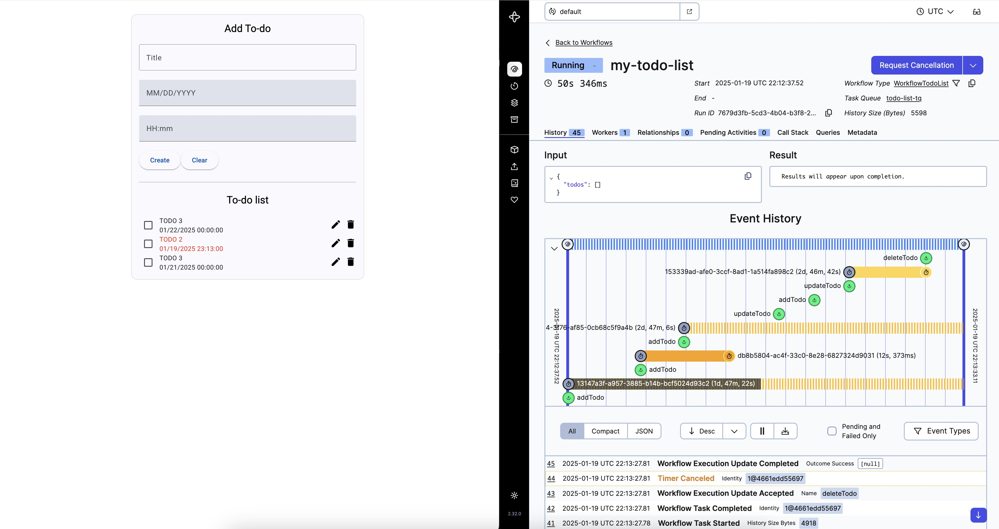

# To-do list with Temporal

This project uses Temporal to build the backend. It implements a long-running workflow. It allows:
- Create, update, delete, and complete tasks.
- Schedule deadlines for each task.




---


## Running the project


### run each component separately


#### start temporal server 

requires [temporal cli](https://docs.temporal.io/cli)

``` bash 
cd temporal-server
./start-server.sh
```

#### start backend

requires jdk 17

``` bash 
cd backend
./start-backend.sh
```

#### start frontend
requires nodejs
``` bash 
cd frontend
./start-frontend.sh
```


### run with docker compose

```bash
docker compose down --remove-orphans
docker compose up --build  --force-recreate  --no-deps

```


